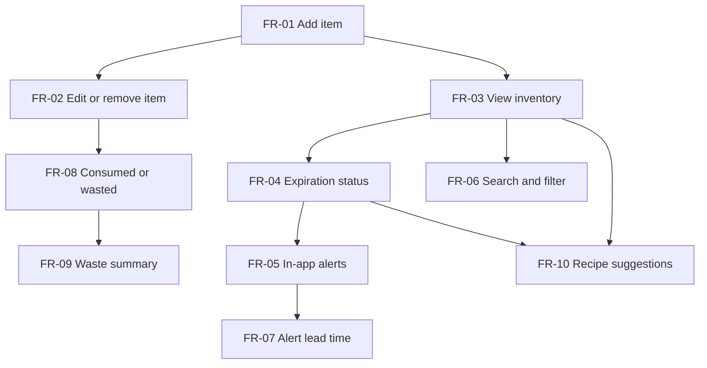

# Requirements Backlog: Pantry Tracker

Outcome of an initial pass of requirements elicitation for a pantry tracking app. The goal is to reduce household food waste by helping a person remember what they bought and use it before it expires.

Scope is set for one developer in half a term: a web app for a single user with no login, with alerts shown inside the app and no external services in the MVP. Only the MVP is a commitment. R2 and Stretch items are built in priority order if time remains.

## Metadata legend

| Tag | Values | Meaning |
|---|---|---|
| ID | `FR-nn`, `NFR-nn` | Functional or non-functional requirement |
| Priority | Must, Should, Could | MoSCoW priority |
| Release | MVP, R2, Stretch | MVP is the smallest useful product. R2 follows it. Stretch is attempted only if time allows |
| Est. | 2, 3, 8 | Relative size in story points. NFRs are constraints, so they have no estimate |
| Depends on | Requirement IDs | Requirements that must exist first |

All requirements have status Proposed.

## Backlog summary

14 requirements: 10 functional, 4 non-functional. By priority: 7 Must, 5 Should, 2 Could. The MVP is 13 story points.

| ID | Requirement | Priority | Release | Est. | Depends on |
|---|---|---|---|---|---|
| FR-01 | Add an item manually | Must | MVP | 3 | none |
| FR-02 | Edit or remove an item | Must | MVP | 2 | FR-01 |
| FR-03 | View inventory sorted by expiration date | Must | MVP | 3 | FR-01 |
| FR-04 | Show expiration status on each item | Must | MVP | 2 | FR-03 |
| FR-05 | In-app expiration alerts | Must | MVP | 3 | FR-04 |
| FR-06 | Search and filter the inventory | Should | R2 | 2 | FR-03 |
| FR-07 | Configure alert lead time | Should | R2 | 2 | FR-05 |
| FR-08 | Mark an item as consumed or wasted | Should | R2 | 2 | FR-02 |
| FR-09 | Waste summary | Could | Stretch | 3 | FR-08 |
| FR-10 | Suggest recipes from current inventory | Could | Stretch | 8 | FR-03, FR-04 |
| NFR-01 | Usability: adding an item is fast | Must | MVP | n/a | FR-01 |
| NFR-02 | Data integrity: input is validated and data persists | Must | MVP | n/a | FR-01 |
| NFR-03 | Performance: inventory loads quickly | Should | R2 | n/a | FR-03 |
| NFR-04 | Maintainability: expiration logic is unit tested | Should | R2 | n/a | FR-04 |

## Dependency graph

An arrow from A to B means B depends on A, so A has to be built first.

The main dependency chain is FR-01, FR-03, FR-04, FR-05. Alerts are the core value of the product and they cannot be built until the three requirements before them exist.

## Functional requirements

### MVP

#### FR-01 Add an item manually

- **Tags:** Must · MVP · 3 points · Depends on: none
- **Story:** As a user, I want to record a grocery item I just bought so that the app knows it is in my pantry.
- **Acceptance criteria:**
  - A user can add an item with a name, quantity, category, and expiration date.
  - Name is required. Quantity defaults to 1. Category and expiration date are optional.
  - The new item appears in the inventory immediately.

#### FR-02 Edit or remove an item

- **Tags:** Must · MVP · 2 points · Depends on: FR-01
- **Story:** As a user, I want to correct or delete an item so that the inventory matches what is really on the shelf.
- **Acceptance criteria:**
  - A user can change any field of an existing item.
  - A user can delete an item, with a confirmation step.

#### FR-03 View inventory sorted by expiration date

- **Tags:** Must · MVP · 3 points · Depends on: FR-01
- **Story:** As a user, I want to see everything I have with the soonest-expiring items first so that I know what to use next.
- **Acceptance criteria:**
  - The inventory screen lists all items, soonest expiration first.
  - Items with no expiration date are listed after dated items.
  - Each row shows name, quantity, and expiration date.

#### FR-04 Show expiration status on each item

- **Tags:** Must · MVP · 2 points · Depends on: FR-03
- **Story:** As a user, I want to see at a glance which items are fine, which are expiring soon, and which have expired.
- **Acceptance criteria:**
  - Expired: the expiration date is before today.
  - Expiring soon: the expiration date is today through 3 days from today, inclusive.
  - Fresh: the expiration date is more than 3 days from today.
  - No date: the item shows no status.
  - Status is shown with a text label, not color alone.

#### FR-05 In-app expiration alerts

- **Tags:** Must · MVP · 3 points · Depends on: FR-04
- **Story:** As a user, I want to be told what is expiring or already expired when I open the app so that I use it or clear it out.
- **Acceptance criteria:**
  - On opening the app, the user sees a banner with the number of items that are expiring soon and the number that are expired.
  - Selecting the banner shows only those items.
  - No banner is shown when there are no items that are expiring soon or expired.
- **Dependency note:** The alert is driven by item status, so the status rules (FR-04) have to exist first.

### R2

#### FR-06 Search and filter the inventory

- **Tags:** Should · R2 · 2 points · Depends on: FR-03
- **Story:** As a user in a store, I want to quickly check whether I already have something so that I do not buy a duplicate.
- **Acceptance criteria:**
  - Typing in a search box narrows the list by item name.
  - The list can be filtered by category.

#### FR-07 Configure alert lead time

- **Tags:** Should · R2 · 2 points · Depends on: FR-05
- **Story:** As a user, I want to choose how many days ahead "expiring soon" means so that alerts fit how I shop and cook.
- **Acceptance criteria:**
  - A user can set the lead time from 1 to 7 days. The default is 3.
  - Item statuses and the alert banner update to match the new setting.

#### FR-08 Mark an item as consumed or wasted

- **Tags:** Should · R2 · 2 points · Depends on: FR-02
- **Story:** As a user, I want to record whether an item was eaten or thrown away so that I can see how much I waste.
- **Acceptance criteria:**
  - A user can mark an item as consumed or wasted in one action from the inventory list.
  - Marking applies to the whole entry, whatever its quantity. To record using only part of an item, the user lowers its quantity with FR-02.
  - Marking an item removes it from the active inventory and keeps it in history.

### Stretch

#### FR-09 Waste summary

- **Tags:** Could · Stretch · 3 points · Depends on: FR-08
- **Story:** As a user, I want to see how many items I wasted each month so that I can tell whether my habits are improving.
- **Acceptance criteria:**
  - A summary shows the number of items consumed and the number wasted per month.
- **Note:** This is a count of items, not a measure of the weight or cost of food wasted.

#### FR-10 Suggest recipes from current inventory

- **Tags:** Could · Stretch · 8 points · Depends on: FR-03, FR-04
- **Story:** As a user, I want recipe ideas that use what I already have, starting with what is expiring, so that I cook from my pantry instead of buying more.
- **Acceptance criteria:**
  - The app shows recipes that use at least one item in the inventory.
  - Recipes that use an "expiring soon" item are listed first.
  - Each recipe shows which ingredients the user has and which are missing.
- **Dependency note:** Needs an external recipe source. Matching item names to recipe ingredients is the main uncertainty.

## Non-functional requirements

Each one is written so it can be tested.

#### NFR-01 Usability: adding an item is fast

- **Tags:** Must · MVP · Depends on: FR-01
- **Requirement:** A first-time user can add an item in 30 seconds or less without instructions.
- **Rationale:** If entering groceries feels like a chore, people stop doing it and every other feature loses its data.

#### NFR-02 Data integrity: input is validated and data persists

- **Tags:** Must · MVP · Depends on: FR-01
- **Requirement:** An item with an empty name, a quantity below 1, or an invalid date is rejected with a message saying what to fix. Saved items are still present after the app is closed and reopened.

#### NFR-03 Performance: inventory loads quickly

- **Tags:** Should · R2 · Depends on: FR-03
- **Requirement:** The inventory screen displays within 2 seconds with up to 200 items.

#### NFR-04 Maintainability: expiration logic is unit tested

- **Tags:** Should · R2 · Depends on: FR-04
- **Requirement:** The expiration status logic is kept separate from the user interface code and has unit tests covering the expired, expiring soon, fresh, and no-date cases, including the boundary dates.

## Out of scope

Raised during elicitation and deliberately left out to keep the project achievable this term:

- User accounts and login
- Shared household accounts and syncing between members
- Barcode or receipt scanning
- Native mobile apps, push notifications, and email alerts
- Offline use
- Shopping lists

## Assumptions

- The app is a web app used by one person, who opens it directly with no login.
- Users are willing to type in groceries after shopping if it takes a minute or two per trip.
- Printed "best by" dates are treated as the expiration date.
- All code is kept in Git as a project practice.

## Open questions for the next elicitation pass

- How do people currently keep track of food at home, if at all?
- Is an in-app banner enough, or do users need to be reached outside the app by email or push notification?
- Would tracking storage location (pantry, refrigerator, freezer) be more useful than food category?
- Which recipe source can be used for FR-10, and under what licence?
